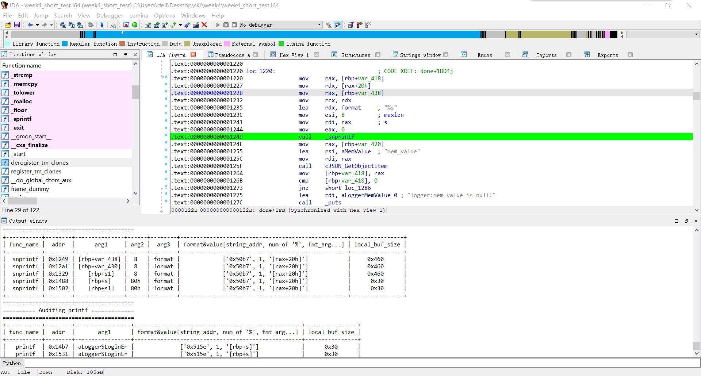

# X86Audit
一个idapython的脚本，自动检测一些好玩的函数。

# 整体思路
代码是倒着的，思路就是分为普通函数和带有fmt的函数，然后分别扫一遍。

# auditAddr
扫描普通函数，这个比较简单因为参数个数是固定的。我们把参数都注释，然后标记call的那一行。

# auditFormat
扫描格式化字符串，这个略微复杂。思路是先找到fmt的地址，前面的都好说，然后把fmt找出来，统计里面的占位符，再去具体找对应的参数。这里顶多找传参寄存器对应的了。

# 关键函数分析
## get_input_from_op
```python
def get_input_from_op(arg_addr):
    Mnemonics = print_insn_mnem(arg_addr) 
    if Mnemonics[0:3] == "add":
        if print_operand(arg_addr, 2) == "":
            arg = print_operand(arg_addr, 0) + "+" + print_operand(arg_addr, 1)
        else:
            arg = print_operand(arg_addr, 1) + "+" +  print_operand(arg_addr, 2)
    elif Mnemonics[0:3] == "sub":
        if print_operand(arg_addr, 2) == "":
            arg = print_operand(arg_addr, 0) + "-" + print_operand(arg_addr, 1)
        else:
            arg = print_operand(arg_addr, 1) + "-" +  print_operand(arg_addr, 2)
    elif "mov" in Mnemonics or "lea" in Mnemonics:
        # 参数不是寄存器
        if(idc.get_operand_type(arg_addr, 1) != 1):
            arg = print_operand(arg_addr, 1) 
        else:
            arg = find_reg(arg_addr, idaapi.get_func(arg_addr).start_ea, idc.print_operand(arg_addr, 1))
    else:
        arg = GetDisasm(arg_addr).split("#")[0]
    return arg
```
这个函数功能是找出影响参数的寄存器，参考了顺顺师傅的思路。

## find_reg
```python
def find_reg(current, start_ea, reg_target):
    if(current >= start_ea):
        current = idc.prev_head(current)
        if(idc.print_operand(current, 0) == reg_target):
            if(idc.get_operand_type(current, 1) != 1):
                if(print_insn_mnem(current)[0:1] != 'j'):
                    return idc.print_operand(current, 1)
                else:
                    return find_reg(current, start_ea, reg_target)
            else:
                return find_reg(current, start_ea, idc.print_operand(current, 1))
        else:
            return find_reg(current, start_ea, reg_target)
    return reg_target
```
递归查找，比方说参数一开始是rax，搜索发现之前rax被赋值了A寄存器，A又被赋值为B+var10，那结果就是B+var10。可以看出这里还有升级的空间，就是我只试图让结果不是单个寄存器，而并没有把里面的寄存器全部翻译掉。递归也可能有bug-.-

## get_arg_addr
```python
def get_arg_addr(start_addr, regNum):
    scan_deep = 50
    count = 0
    reg = reg_x64[regNum]
    # try to get before
    before_addr = get_first_cref_to(start_addr)
    while before_addr != BADADDR:
        if reg in print_operand(before_addr, 0):
            Mnemonics = print_insn_mnem(before_addr)
            if Mnemonics[0:1] == "j":
                pass
            else:
                return before_addr
        count = count + 1
        if count > scan_deep:
            break 
        before_addr = get_first_cref_to(before_addr)
    return BADADDR
```
获取参数地址。在实现fmt类函数的扫描时发现```idaapi.get_arg_addrs(call_addr)```这个只能达到fmt的位置，后面的就得自己找了。采用尝试性搜索的方式。

# 功能
能以表格形式输出这些函数的信息，并且双击地址就能跳过去。


# 参考
[https://github.com/giantbranch/mipsAudit](https://github.com/giantbranch/mipsAudit)
